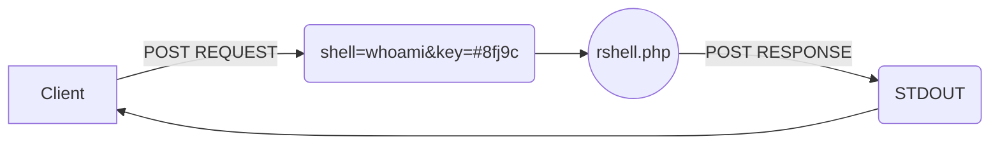

# rservice.control
Simple HTTP API for remote service control

### **How to use ?**
```sh
./genkeys.sh
php -S localhost:9000
```

### **How it works ?**

```mermaid
graph LR
A[Client] -- POST REQUEST --> C
C --> B((rshell.php))
B --POST RESPONSE--> D(STDOUT)
D --> A
C(shell=whoami&key=#8fj9c)
```
