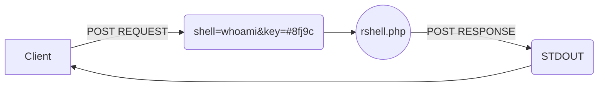

# rservice.control
Simple HTTP API for remote service control

### **How to use ?**
**Server-Side**
```sh
./genkeys.sh
php -S localhost:9000
```
**Client-Side**
```sh
pip install -r requirements.txt
export RSHELL_URL="http://rservice.init64.ltd"
export RSHELL_KEY="$(cat $path_to_your_key)"
./rclient whoami
```

### **How it works ?**

